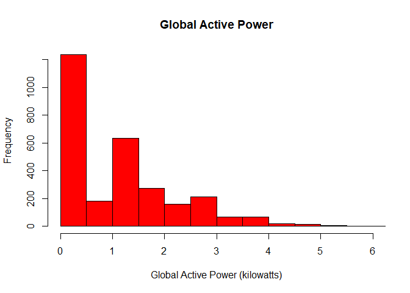
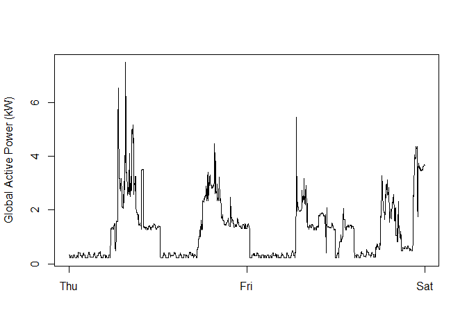
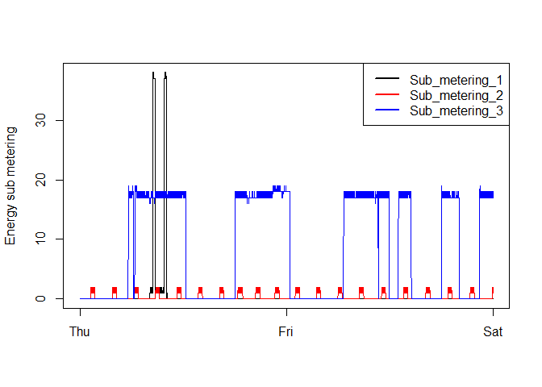
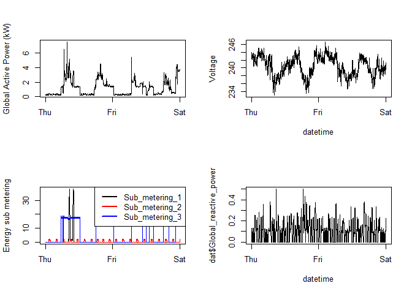

When loading the dataset into R, please consider the following:

-   The dataset has 2,075,259 rows and 9 columns. First calculate a
    rough estimate of how much memory the dataset will require in memory
    before reading into R. Make sure your computer has enough memory
    (most modern computers should be fine).

-   We will only be using data from the dates 2007-02-01 and 2007-02-02.
    One alternative is to read the data from just those dates rather
    than reading in the entire dataset and subsetting to those dates.

-   You may find it useful to convert the Date and Time variables to
    Date/Time classes in R using the strptime() and as.Date() functions.

-   Note that in this dataset missing values are coded as ?.

<!-- -->

    power <- read.table('C:/REPO/datasciencecoursera/4.Exploratory_Data_Analysis/exdata_data_household_power_consumption/household_power_consumption.txt', sep = ";", header = T,na.strings="?",colClasses = c(character(),
                                             character(),
                                             numeric(),
                                             numeric(),
                                             numeric(),
                                             numeric(),
                                             numeric(),
                                             numeric(),
                                             numeric()))
    str(power)

    ## 'data.frame':    2075259 obs. of  9 variables:
    ##  $ Date                 : chr  "16/12/2006" "16/12/2006" "16/12/2006" "16/12/2006" ...
    ##  $ Time                 : chr  "17:24:00" "17:25:00" "17:26:00" "17:27:00" ...
    ##  $ Global_active_power  : num  4.22 5.36 5.37 5.39 3.67 ...
    ##  $ Global_reactive_power: num  0.418 0.436 0.498 0.502 0.528 0.522 0.52 0.52 0.51 0.51 ...
    ##  $ Voltage              : num  235 234 233 234 236 ...
    ##  $ Global_intensity     : num  18.4 23 23 23 15.8 15 15.8 15.8 15.8 15.8 ...
    ##  $ Sub_metering_1       : num  0 0 0 0 0 0 0 0 0 0 ...
    ##  $ Sub_metering_2       : num  1 1 2 1 1 2 1 1 1 2 ...
    ##  $ Sub_metering_3       : num  17 16 17 17 17 17 17 17 17 16 ...

    library(lubridate)

    ## 
    ## Attaching package: 'lubridate'

    ## The following objects are masked from 'package:base':
    ## 
    ##     date, intersect, setdiff, union

    library(dplyr)

    ## 
    ## Attaching package: 'dplyr'

    ## The following objects are masked from 'package:stats':
    ## 
    ##     filter, lag

    ## The following objects are masked from 'package:base':
    ## 
    ##     intersect, setdiff, setequal, union

    power <- power %>% mutate(exact_time = paste(Date, Time, sep=" "))
    head(power$exact_time)

    ## [1] "16/12/2006 17:24:00" "16/12/2006 17:25:00" "16/12/2006 17:26:00"
    ## [4] "16/12/2006 17:27:00" "16/12/2006 17:28:00" "16/12/2006 17:29:00"

    library(dplyr)
    library(tidyverse)

    ## -- Attaching packages --------------------------------------- tidyverse 1.3.1 --

    ## v ggplot2 3.3.5     v purrr   0.3.4
    ## v tibble  3.1.6     v stringr 1.4.0
    ## v tidyr   1.2.0     v forcats 0.5.1
    ## v readr   2.1.2

    ## -- Conflicts ------------------------------------------ tidyverse_conflicts() --
    ## x lubridate::as.difftime() masks base::as.difftime()
    ## x lubridate::date()        masks base::date()
    ## x dplyr::filter()          masks stats::filter()
    ## x lubridate::intersect()   masks base::intersect()
    ## x dplyr::lag()             masks stats::lag()
    ## x lubridate::setdiff()     masks base::setdiff()
    ## x lubridate::union()       masks base::union()

    power$exact_time2 <- lubridate::dmy_hms(power$exact_time)
    power$datee <- dmy(power$Date)
    #dat <- power %>% filter(lubridate::date(exact_time2) %in% c(as.Date("2007-02-01"),as.Date("2007-02-02")))
    dat <- power %>% filter((datee >= "2007-02-01") & (datee <= "2007-02-02"))
    head(dat)

    ##       Date     Time Global_active_power Global_reactive_power Voltage
    ## 1 1/2/2007 00:00:00               0.326                 0.128  243.15
    ## 2 1/2/2007 00:01:00               0.326                 0.130  243.32
    ## 3 1/2/2007 00:02:00               0.324                 0.132  243.51
    ## 4 1/2/2007 00:03:00               0.324                 0.134  243.90
    ## 5 1/2/2007 00:04:00               0.322                 0.130  243.16
    ## 6 1/2/2007 00:05:00               0.320                 0.126  242.29
    ##   Global_intensity Sub_metering_1 Sub_metering_2 Sub_metering_3
    ## 1              1.4              0              0              0
    ## 2              1.4              0              0              0
    ## 3              1.4              0              0              0
    ## 4              1.4              0              0              0
    ## 5              1.4              0              0              0
    ## 6              1.4              0              0              0
    ##          exact_time         exact_time2      datee
    ## 1 1/2/2007 00:00:00 2007-02-01 00:00:00 2007-02-01
    ## 2 1/2/2007 00:01:00 2007-02-01 00:01:00 2007-02-01
    ## 3 1/2/2007 00:02:00 2007-02-01 00:02:00 2007-02-01
    ## 4 1/2/2007 00:03:00 2007-02-01 00:03:00 2007-02-01
    ## 5 1/2/2007 00:04:00 2007-02-01 00:04:00 2007-02-01
    ## 6 1/2/2007 00:05:00 2007-02-01 00:05:00 2007-02-01

    #png("plot1.png")
    #dat$Global_active_power <- as.numeric(dat$Global_active_power)
    hist(as.numeric(dat$Global_active_power),
         main = "Global Active Power",
         xlab = "Global Active Power (kilowatts)",
         xlim = c(0,6),
         col = "red")

    #dev.off()
    # breaks = c(0.0, 0.5, 1.0, 1.5, 2.0, 2.5, 3.0, 3.5, 4.0, 4.5, 5.0, 5.5, 6.0),

    #png("plot2.png")
        plot(dat$exact_time2,
             dat$Global_active_power,
             type="l",
             xlab="",
             ylab="Global Active Power (kW)")

    #dev.off()

    #png("plot3.png")
        plot(dat$exact_time2,
             dat$Sub_metering_1,
             type="l",
             xlab="",
             ylab="Energy sub metering")
        lines(dat$exact_time2,
             dat$Sub_metering_2,
             type="l",
             col = "red")
        lines(dat$exact_time2,
             dat$Sub_metering_3,
             type="l",
             col = "blue")
        legend(x = "topright",
               legend = c("Sub_metering_1","Sub_metering_2","Sub_metering_3"),
               lty = 1,
               lwd = 2.5,
               col = c("black","red","blue"))

    #dev.off()

    #png("plot4.png")

    par(mfrow = c(2,2))
        plot(dat$exact_time2,
             dat$Global_active_power,
             type="l",
             xlab="",
             ylab="Global Active Power (kW)")

        plot(dat$exact_time2,
             dat$Voltage,
             type="l",
             xlab="datetime",
             ylab="Voltage")

        plot(dat$exact_time2,
             dat$Sub_metering_1,
             type="l",
             xlab="",
             ylab="Energy sub metering")
        lines(dat$exact_time2,
             dat$Sub_metering_2,
             type="l",
             col = "red")
        lines(dat$exact_time2,
             dat$Sub_metering_3,
             type="l",
             col = "blue")
        legend(x = "topright",
               legend = c("Sub_metering_1","Sub_metering_2","Sub_metering_3"),
               lty = 1,
               lwd = 2.5,
               col = c("black","red","blue"))
        
        plot(dat$exact_time2,
             dat$Global_reactive_power,
             type="l",
             xlab="datetime")

    #dev.off()
