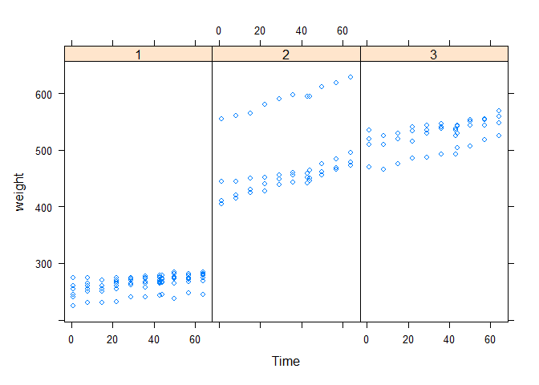

------------------------------------------------------------------------

#### Question 2

##### Question 2 What is produced by the following code?

    library(nlme)
    library(lattice)
    xyplot(weight ~ Time | Diet, BodyWeight)

------------------------------------------------------------------------

#### Question 3

##### Annotation of plots in any plotting system involves adding points, lines, or text to the plot, in addition to customizing axis labels or adding titles. Different plotting systems have different sets of functions for annotating plots in this way.Which of the following functions can be used to annotate the panels in a multi-panel lattice plot?

-   lines()

-   axis()

-   **panel.lmline()**

-   points()

------------------------------------------------------------------------

#### Question 6

##### What is ggplot2 an implementation of?

-   a 3D visualization system

-   **the Grammar of Graphics developed by Leland Wilkinson**

-   the base plotting system in R

-   the S language originally developed by Bell Labs

------------------------------------------------------------------------

#### Question 8

##### What is a geom in the ggplot2 system?

-   a statistical transformation

-   **a plotting object like point, line, or other shape**

-   a method for making conditioning plots

-   a method for mapping data to attributes like color and size

------------------------------------------------------------------------
