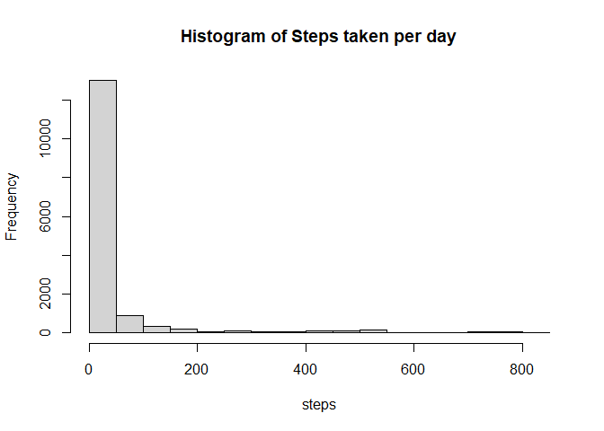
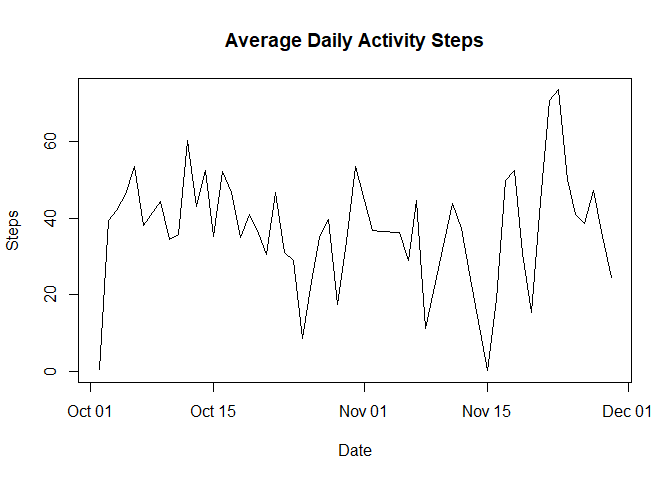
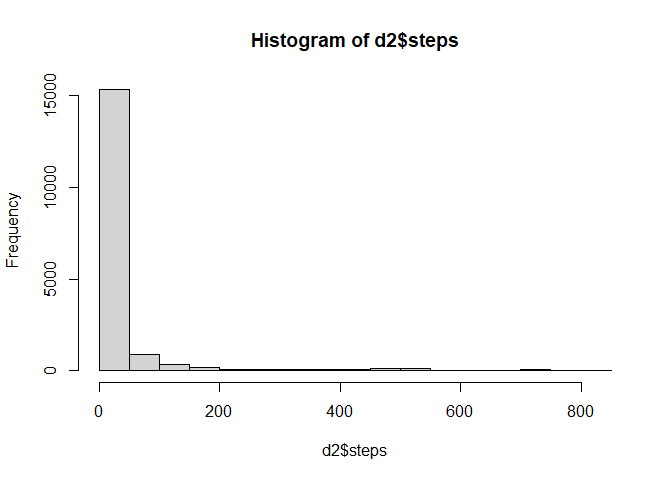
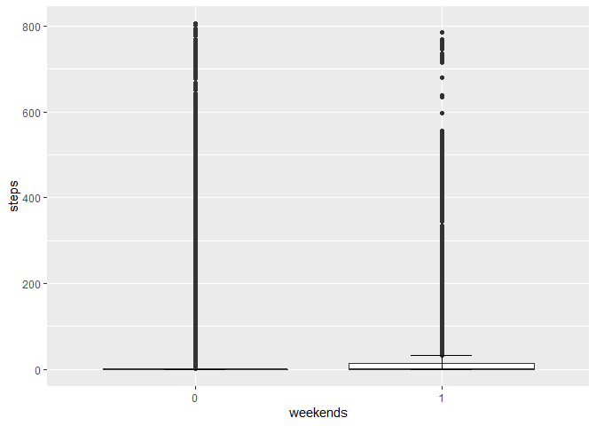

## Loading and preprocessing the data

```r
d <- read.csv("C:/REPO/datasciencecoursera/5.Reproducible_Research/activity.csv")
## d <- read.csv("./5.Reproducible_Research/activity.csv")
```

## Loading and preprocessing the data

```r
dat <- na.omit(d$steps)
mean(dat)
```

```
## [1] 37.3826
```
The total number of steps taken per day is 37.3826.  

```r
hist(dat,
     main = "Histogram of Steps taken per day",
     xlab = "steps")
```

<!-- -->
  
## What is the average daily activity pattern?

```r
library(dplyr)
```

```
## 
## Attaching package: 'dplyr'
```

```
## The following objects are masked from 'package:stats':
## 
##     filter, lag
```

```
## The following objects are masked from 'package:base':
## 
##     intersect, setdiff, setequal, union
```

```r
df <- d %>% filter(!is.na(steps))
df$date2 <- as.Date(df$date)
dt <- df %>% 
      group_by(date2) %>% 
      summarise(avg_steps = mean(steps),
                median_steps = median(steps))
head(dt)
```

```
## # A tibble: 6 x 3
##   date2      avg_steps median_steps
##   <date>         <dbl>        <dbl>
## 1 2012-10-02     0.438            0
## 2 2012-10-03    39.4              0
## 3 2012-10-04    42.1              0
## 4 2012-10-05    46.2              0
## 5 2012-10-06    53.5              0
## 6 2012-10-07    38.2              0
```

```r
plot(dt$date2,dt$avg_steps,
     type="l",
     main = "Average Daily Activity Steps",
     xlab="Date",
     ylab="Steps")
```

<!-- -->


## Imputing missing values
1. Calculate and report the total number of missing values in the dataset (i.e. the total number of rows with \color{red}{\verb|NA|}NAs)  

```r
sum(is.na(d$steps))
```

```
## [1] 2304
```
  
2. Devise a strategy for filling in all of the missing values in the dataset. The strategy does not need to be sophisticated. For example, you could use the mean/median for that day, or the mean for that 5-minute interval, etc.   

```r
## use the mean to replace the missing values
library(plyr);library(dplyr)
```

```
## ------------------------------------------------------------------------------
```

```
## You have loaded plyr after dplyr - this is likely to cause problems.
## If you need functions from both plyr and dplyr, please load plyr first, then dplyr:
## library(plyr); library(dplyr)
```

```
## ------------------------------------------------------------------------------
```

```
## 
## Attaching package: 'plyr'
```

```
## The following objects are masked from 'package:dplyr':
## 
##     arrange, count, desc, failwith, id, mutate, rename, summarise,
##     summarize
```

```r
impute.med <- function(x)replace(x, is.na(x), median(x, na.rm = TRUE))
```

3. Create a new dataset that is equal to the original dataset but with the missing data filled in.  

```r
## plyr method
## d2 <- ddply(d, ~ date, transform, steps = impute.mean(steps))

## dplyr method
d2 <- d %>%
        group_by(date) %>%
        mutate(
            steps = impute.med(steps)
        )
```

4. Make a histogram of the total number of steps taken each day and Calculate and report the mean and median total number of steps taken per day. Do these values differ from the estimates from the first part of the assignment? What is the impact of imputing missing data on the estimates of the total daily number of steps?   

```r
hist(d2$steps)
```

<!-- -->


```r
detach(package:plyr)
d2 <- data.frame(d2)
#d2$date <- as.Date(d2$date)
dt2 <- d2 %>% 
      group_by(date) %>% 
      summarise(avg_steps = mean(steps),
                median_steps = median(steps))
dt2
```

```
## # A tibble: 61 x 3
##    date       avg_steps median_steps
##    <chr>          <dbl>        <dbl>
##  1 2012-10-01     0                0
##  2 2012-10-02     0.438            0
##  3 2012-10-03    39.4              0
##  4 2012-10-04    42.1              0
##  5 2012-10-05    46.2              0
##  6 2012-10-06    53.5              0
##  7 2012-10-07    38.2              0
##  8 2012-10-08     0                0
##  9 2012-10-09    44.5              0
## 10 2012-10-10    34.4              0
## # ... with 51 more rows
```


```r
dt2$date <- as.Date(dt2$date)
plot(dt2$date,dt2$avg_steps,
     type="l",
     main = "Average Daily Activity Steps",
     xlab="Date",
     ylab="Steps")
```

<!-- -->


## Are there differences in activity patterns between weekdays and weekends?

```r
d2$date <- as.Date(d2$date)
d2 <- d2 %>% mutate(wday = weekdays(date),
              weekends = ifelse(wday %in% c("Saturday","Sunday" ),1,0))
table(d2$weekends)
```

```
## 
##     0     1 
## 12960  4608
```

```r
library(dplyr)
d2 %>% group_by(weekends) %>%
    summarise(mean_steps = mean(steps),
              median_steps = median(steps))
```

```
## # A tibble: 2 x 3
##   weekends mean_steps median_steps
##      <dbl>      <dbl>        <dbl>
## 1        0       30.6            0
## 2        1       37.7            0
```
The median steps are the same, but we could infer from the mean that people generally walk more during weekends.  


```r
library(ggplot2)
d2$weekends = factor(d2$weekends)
ggplot(d2,aes(x = weekends, y= steps))+
    geom_boxplot() +
    stat_boxplot(geom = "errorbar",
               width = 0.25)  
```

<!-- -->

