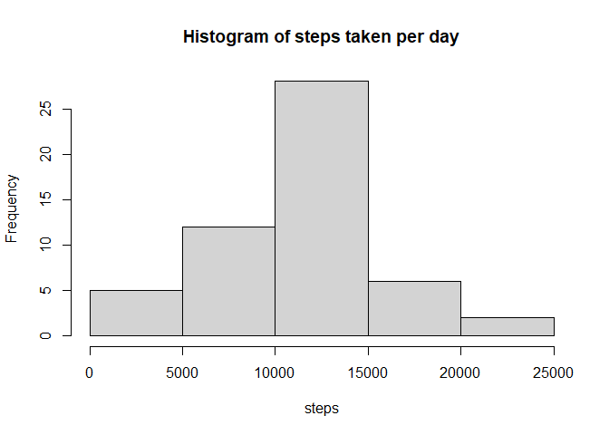
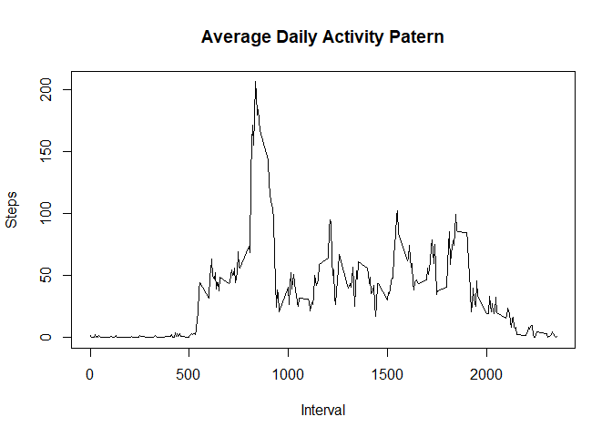
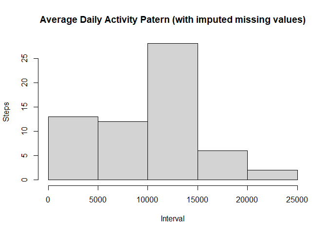
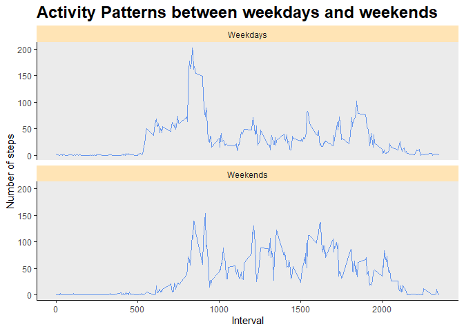

## Loading and preprocessing the data

```r
d <- read.csv("C:/REPO/datasciencecoursera/5.Reproducible_Research/activity.csv")
## d <- read.csv("./5.Reproducible_Research/activity.csv")
```

## Loading and preprocessing the data

```r
library(dplyr)
```

```
## 
## Attaching package: 'dplyr'
```

```
## The following objects are masked from 'package:stats':
## 
##     filter, lag
```

```
## The following objects are masked from 'package:base':
## 
##     intersect, setdiff, setequal, union
```

```r
dat <- d[!is.na(d$steps),]
dat$date <- as.Date(dat$date)
daily_df <- dat %>% group_by(date) %>%
    summarise(daily_steps = sum(steps))
mean(daily_df$daily_steps);median(daily_df$daily_steps)
```

```
## [1] 10766.19
```

```
## [1] 10765
```
The total number of steps taken per day is 10766.19, and the median is 10765.  

## What is mean total number of steps taken per day?  

```r
hist(daily_df$daily_steps,
     main = "Histogram of steps taken per day",
     xlab = "steps")
```

<!-- -->
  
## What is the average daily activity pattern?  
1. Make a time series plot (i.e. type = "l") of the 5-minute interval (x-axis) and the average number of steps taken, averaged across all days (y-axis)  

2. Which 5-minute interval, on average across all the days in the dataset, contains the maximum number of steps?  

```r
df <- d %>% filter(!is.na(steps))
df$date2 <- as.Date(df$date)
dt <- df %>% 
      group_by(interval) %>% 
      summarise(avg_steps = mean(steps),
                median_steps = median(steps))
head(dt)
```

```
## # A tibble: 6 x 3
##   interval avg_steps median_steps
##      <int>     <dbl>        <int>
## 1        0    1.72              0
## 2        5    0.340             0
## 3       10    0.132             0
## 4       15    0.151             0
## 5       20    0.0755            0
## 6       25    2.09              0
```

```r
plot(dt$interval,dt$avg_steps,
     type="l",
     main = "Average Daily Activity Patern",
     xlab="Interval",
     ylab="Steps")
```

<!-- -->

```r
dt[which.max(dt$avg_steps),]
```

```
## # A tibble: 1 x 3
##   interval avg_steps median_steps
##      <int>     <dbl>        <int>
## 1      835      206.           19
```
The 835 interval contains the maximum number of steps.  

## Imputing missing values
1. Calculate and report the total number of missing values in the dataset (i.e. the total number of rows with \color{red}{\verb|NA|}NAs)  

```r
sum(is.na(d$steps))
```

```
## [1] 2304
```
  
2. Devise a strategy for filling in all of the missing values in the dataset. The strategy does not need to be sophisticated. For example, you could use the mean/median for that day, or the mean for that 5-minute interval, etc.   

```r
## use the mean to replace the missing values
library(plyr);library(dplyr)
```

```
## ------------------------------------------------------------------------------
```

```
## You have loaded plyr after dplyr - this is likely to cause problems.
## If you need functions from both plyr and dplyr, please load plyr first, then dplyr:
## library(plyr); library(dplyr)
```

```
## ------------------------------------------------------------------------------
```

```
## 
## Attaching package: 'plyr'
```

```
## The following objects are masked from 'package:dplyr':
## 
##     arrange, count, desc, failwith, id, mutate, rename, summarise,
##     summarize
```

```r
impute.med <- function(x)replace(x, is.na(x), median(x, na.rm = TRUE))
```

3. Create a new dataset that is equal to the original dataset but with the missing data filled in.  

```r
## plyr method
## d2 <- ddply(d, ~ date, transform, steps = impute.mean(steps))

## dplyr method
d2 <- d %>%
        group_by(date) %>%
        mutate(
            steps = impute.med(steps)
        )
```

4. Make a histogram of the total number of steps taken each day and Calculate and report the mean and median total number of steps taken per day. Do these values differ from the estimates from the first part of the assignment? What is the impact of imputing missing data on the estimates of the total daily number of steps?   

```r
daily_df2 <- d2 %>% dplyr::group_by(date) %>%
    dplyr::summarise(daily_steps = sum(steps))
mean(daily_df2$daily_steps);median(daily_df2$daily_steps)
```

```
## [1] 9354.23
```

```
## [1] 10395
```
Impute missing data: The total number of steps taken per day is 9354.23, and the median is 10395.  
Remove missing data: The total number of steps taken per day is 10766.19, and the median is 10765.  
Using imputed data, we will have smaller median and mean.   


```r
hist(daily_df2$daily_steps,
     main = "Average Daily Activity Patern (with imputed missing values)",
     xlab="Interval",
     ylab="Steps")
```

<!-- -->


```r
detach(package:plyr)
d2 <- data.frame(d2)
#d2$date <- as.Date(d2$date)
dt2 <- d2 %>% 
      group_by(date) %>% 
      summarise(avg_steps = mean(steps),
                median_steps = median(steps))
#dt2
```


The values do not differ greatly from the estimates from the first part of the assignment.  

## Are there differences in activity patterns between weekdays and weekends?

```r
d2$date <- as.Date(d2$date)
d2 <- d2 %>% mutate(wday = weekdays(date),
              weekends = ifelse(wday %in% c("Saturday","Sunday" ),1,0))
table(d2$weekends)
```

```
## 
##     0     1 
## 12960  4608
```


```r
library(dplyr)
df2 <- d2 %>% group_by(weekends,interval) %>%
    summarise(mean_steps = mean(steps),
              median_steps = median(steps))
```

```
## `summarise()` has grouped output by 'weekends'. You can override using the
## `.groups` argument.
```

```r
df2
```

```
## # A tibble: 576 x 4
## # Groups:   weekends [2]
##    weekends interval mean_steps median_steps
##       <dbl>    <int>      <dbl>        <dbl>
##  1        0        0     2.02              0
##  2        0        5     0.4               0
##  3        0       10     0.156             0
##  4        0       15     0.178             0
##  5        0       20     0.0889            0
##  6        0       25     1.31              0
##  7        0       30     0.622             0
##  8        0       35     1.02              0
##  9        0       40     0                 0
## 10        0       45     1.6               0
## # ... with 566 more rows
```
The median steps are the same, but we could infer from the mean that people generally walk more during weekends.  


```r
#df2$weekends = factor(df2$weekends, levels = c(0,1), labels = c("Weekdays", "Weekends"))
```


```r
library(ggplot2)

df2$weekends = factor(df2$weekends, levels = c(0,1), labels = c("Weekdays", "Weekends"))

ggplot(df2,aes(x = interval, y= mean_steps))+
    geom_line(col = 'cornflowerblue') +
    facet_wrap(~weekends, ncol = 1) +
 labs(x="Interval", y="Number of steps", title = "Activity Patterns between weekdays and weekends")+
 theme(panel.border = element_blank(), 
 panel.grid.major = element_blank(),
 panel.grid.minor = element_blank(),
 axis.line = element_line(colour = "black"),
 plot.title = element_text(size = 18, face = "bold"),
 strip.background = element_rect(fill="moccasin"))
```

<!-- -->
  
It seems that people will have more activities in morning during weekends, but have more activities in the afternoons during weekends. 

The median steps are the same, but we could infer from the mean that people generally walk more during weekends.  
